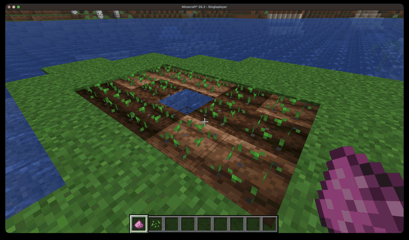

<p align="center">
  
</p>

# Fertile Grounds

[](https://github.com/Adi-UA/fertile-grounds/actions/workflows/build.yml)

[](https://modrinth.com/mod/fertile-grounds) 596 downloads as of 2026-10-01: 358 on Modrinth, 238 on CurseForge.

Available on [CurseForge](https://www.curseforge.com/minecraft/mc-mods/fertile-grounds) and [Modrinth](https://modrinth.com/mod/fertile-grounds).

Fertile Grounds is a Fabric mod for Minecraft 26.3 that adds tiered soil-enrichment blocks. Place one once, and it has a chance every so often to bone-meal whatever grows on top of it on its own, so you stop manually reapplying bone meal to the same farm every few minutes. That works out to roughly 4x faster growth on Tier 1/Tier 2 soil and roughly 11x faster on Super Enriched soil, for a single well-watered crop. It's a convenience upgrade, not a balance-breaking one: the soil still floods, dries out, and gets trampled like normal dirt or sand.


*Recorded with `/gamerule randomTickSpeed 100` to make the difference visible in a short clip. Default random tick speed (3) looks the same relative to each other, just much slower in real time.*



**New in version 1.2.0: Bean Fairies.** Like Stardew Valley's Crop Fairy, one can show up on any night and fully grow a patch of your crops. Or craft Fairy Dust and sprinkle it on a crop to guarantee a visit that night.

Coming Soon: Put Bean Fairies in a jar to ...?

## What it adds

Three tiers, each a drop-in soil upgrade that behaves like its vanilla counterpart (till it, plant on it, it still floods/dries/tramples) but with a chance per random tick to instantly advance whatever's growing on top of it, as if bone-mealed:

| Tier | Block(s) | Crafted from | Boost chance/tick |
|---|---|---|---|
| 1 | Enriched Dirt / Enriched Farmland | Dirt + Bone Meal | 15% |
| 2 | Enriched Sand | Sand + Bone Meal | 15% |
| 3 | Super Enriched Dirt / Super Enriched Farmland | Dirt + Bone Meal + Glowstone Dust | 50% |

All three are craftable (shapeless, 1:1:1, no crafting table shape required) and unlock in the recipe book the first time you hold the right ingredients.

**Enriched Dirt / Super Enriched Dirt** work exactly like vanilla dirt: till them into farmland with a hoe, only the farmland form accepts crops. Their farmland reverts back to their *own* dirt tier (not vanilla dirt) on drought or trampling, and shows a darker, moist texture at full hydration, same as vanilla farmland.

**Enriched Sand** behaves like vanilla sand (sugar cane can still be planted on it near water), no tilling involved. It boosts whatever bonemealable plant is directly on top of it, bamboo is the clearest example since it can grow on sand; sugar cane and cactus don't accept bone meal in vanilla, so they grow at normal speed on it either way.

All of the mod's items live in their own creative-inventory tab, "Fertile Grounds."

### Bean Fairy

Like Stardew Valley's Crop Fairy, a Bean Fairy (a tiny winged edamame pod) sometimes visits a farm at night and fully grows every crop in a 5x5 patch. Each night, every player in the Overworld has a 1% chance of a visit to a random crop within 16 blocks. If everyone sleeps through it, the crops are grown at dawn anyway.

To call one on purpose, craft **Fairy Dust** (shapeless: Glowstone Dust + Amethyst Shard + Bone Meal) and use it on a growing crop. Fairies still only come at night: within about 30 seconds if it's already dark, otherwise at nightfall. Only crops in the vanilla `#minecraft:crops` tag count (wheat, carrots, potatoes, beetroots, melon and pumpkin stems, torchflowers, pitcher plants).

The creative tab also has a Bean Fairy Spawn Egg, which sends a fairy to the nearest crop.

## Minecraft version

This branch targets Minecraft 26.3. Other supported versions live on their own branches, each an independently maintained port (changes aren't shared automatically between them):

| Branch | Minecraft version |
|---|---|
| `1.20.1` | 1.20.1 |
| `1.21.1` | 1.21.1 |
| `1.21.10` | 1.21.10 |
| `1.21.11` | 1.21.11 |
| `26.1` | 26.1 |
| `26.2` | 26.2 |
| `26.3` / `main` | 26.3 (this branch, latest supported version) |

## Requirements

- Minecraft 26.3
- [Fabric Loader](https://fabricmc.net/) 0.19.5+
- [Fabric API](https://modrinth.com/mod/fabric-api) 0.161.0+26.3
- Java 25+

## Building from source

```
./gradlew build
```

The mod jar is output to `build/libs/fertilegrounds-<mod version>+<minecraft version>.jar` (e.g. `fertilegrounds-1.2.0+26.3.jar`). The `+<mc version>` suffix matches Fabric's own convention (see Fabric API's own release names) and keeps jars from different branches from colliding if you're collecting builds from more than one version in the same place. Drop it in your `mods/` folder alongside Fabric API.

## Development

```
./gradlew runClient      # launch a dev client with the mod loaded
./gradlew spotlessApply  # auto-format code
```

## Art

The art in the repo is partially AI generated. I am using AI to help me learn pixel art and so I get it to draw guides for me which I trace over. I also ask it for help for to learn Aseprite better and also slowly learn color theory and how Minecraft models work. I am open to suggestions for other ways to learn in a way where I can still keep learning to build Minecraft mods at the same pace

I am just tracing over vanilla textures to avoid stealing stylistic choices from others.

## License

MIT. See `LICENSE`.
