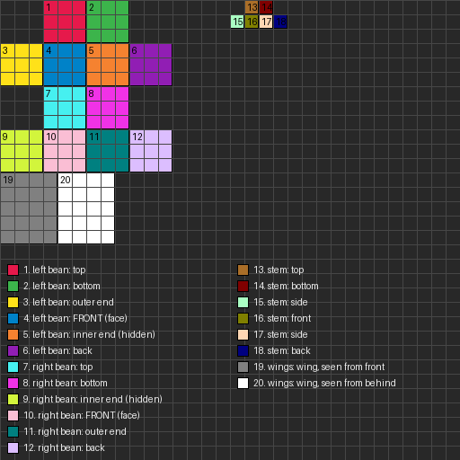

# Painting the Bean Fairy

The mod ships with placeholder art, so everything works before you paint anything. This guide covers replacing it with your own.

## The fairy (`textures/entity/bean_fairy.png`, 32x32)

The fairy's 3D shape lives in code (`BeanFairyModel.java`). Each flat face of each box reads its colors from one rectangle in the 32x32 texture. `bean_fairy_template.png` paints every rectangle a different flat color, and `bean_fairy_guide.png` numbers them with a legend:



The pod is two 3x3x3 beans side by side (left bean, right bean), plus a 1-pixel stem on top. Faces marked "inner end (hidden)" touch the other bean, so nobody sees them. Both wings share one 4x5 area (the right wing is a mirror image of the left), seen from the front in area 19 and from behind in area 20.

Steps in Aseprite:

1. Open `bean_fairy_template.png`. Turn on View > Grid (Ctrl/Cmd+') and set the grid to 1x1 so each pixel is one cell.
2. Add a new layer above the template (Layer > New Layer). Paint on this layer only.
3. Fill each colored rectangle on your layer, staying inside its edges. Anything outside the rectangles is never shown in game.
4. Keep every pixel fully opaque or fully empty. The game draws half-transparent pixels as either solid or invisible.
5. Hide or delete the template layer, then File > Export As over `src/main/resources/assets/fertilegrounds/textures/entity/bean_fairy.png`.
6. Run `./gradlew runClient`, open a world, and use the Bean Fairy Spawn Egg near a crop to see it.

A starting palette, matching the placeholder:

| Use | Hex |
|---|---|
| Pod | `#7FB83E` |
| Pod shadow (bottoms, back) | `#5A8F2A` |
| Pod highlight (tops) | `#A6D65B` |
| Stem | `#4A6E26` |
| Eyes | `#22281E` |
| Wings | `#E6F7FF` |
| Wing veins | `#A9D8EE` |

Tips: put one eye on each bean's FRONT face (areas 4 and 10), shade the bottom row of each side face one step darker, and draw a darker line where the two beans meet so they read as a pair.

## Fairy Dust (`textures/item/fairy_dust.png`, 16x16)

Same approach as the dirt and sand textures: the placeholder is vanilla Glowstone Dust with its hue turned pink. Open it in Aseprite, adjust with Edit > Adjustments > Hue/Saturation, and add a few white sparkle pixels.

## Spawn egg (`textures/item/bean_fairy_spawn_egg.png`, 16x16)

The placeholder is vanilla's Allay spawn egg recolored green. Recolor it the same way, using the pod greens for the shell and a wing color for the spots.

## Regenerating

`~/Documents/helper-scripts/bean_fairy_art.py` rebuilds the template, the guide, and every placeholder. It overwrites your painted textures, so only run it before you start painting or after you move parts in `BeanFairyModel.java`:

```
uv run ~/Documents/helper-scripts/bean_fairy_art.py . ~/.gradle/caches/fabric-loom/<mc version>/minecraft-client.jar
```
